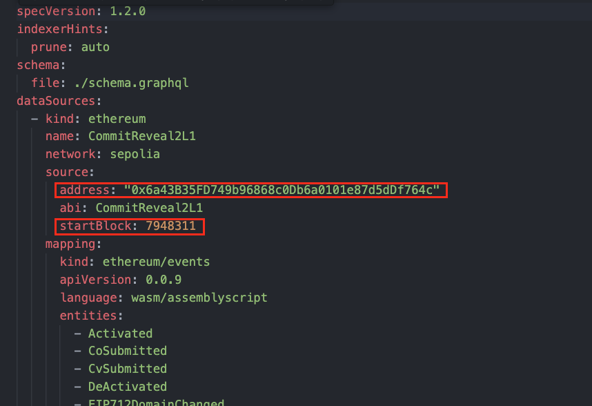
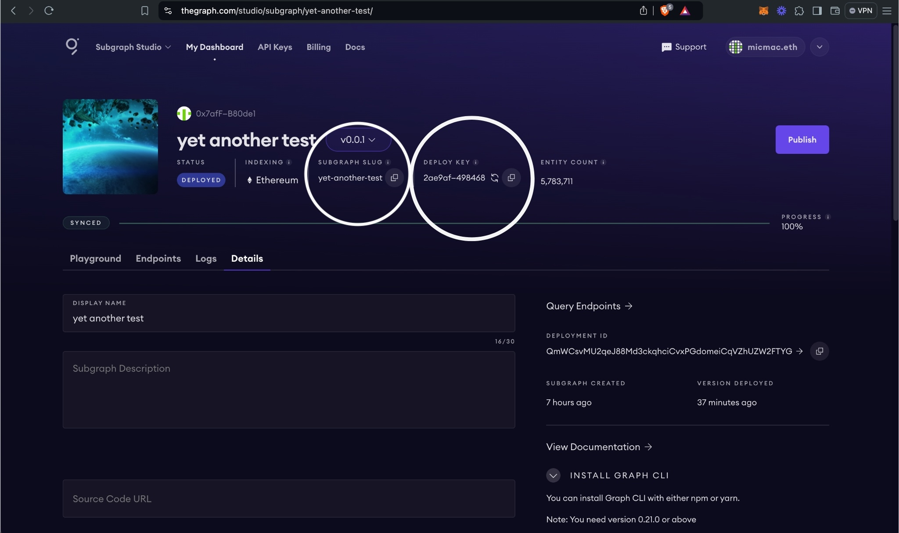

# Subgraph Deployment Guide

This guide walks you through creating, deploying, and testing a Subgraph using [The Graph’s Subgraph Studio](https://thegraph.com/studio/).

---

## 1. Create a Subgraph in Subgraph Studio

1. **Navigate to Subgraph Studio**  
   Go to [Subgraph Studio](https://thegraph.com/studio/) and connect your wallet.

   Subgraph Studio allows you to create, manage and deploy Subgraphs, as well as manage API keys.

2. **Create a New Subgraph**  
   Click **“Create a Subgraph.”** For clarity, give it a title-case name (e.g., **“Commit-Reveal2”**).

---

## 2. Install the Graph CLI

On your local machine, install the Graph CLI:

```
yarn global add @graphprotocol/graph-cli
```

---

## 3. Deploy Your Subgraph

When you deploy a Subgraph, you push it to Subgraph Studio, where you can test, stage, and review it. The indexing is done by a single **Upgrade Indexer** operated by Edge & Node, rather than by multiple Indexers on the decentralized network. Deployed Subgraphs in this environment are:

- **Free to use**
- **Rate-limited**
- **Meant for development, staging, and testing**

### 3.1 Configure `subgraph.yaml`

Make sure your `subgraph.yaml` file is properly set up. For example:

set startBlock to the contract creation block.

_(Illustrative image below)_  


### 3.2 Build the Subgraph

Before deploying, run:

```
graph codegen && graph build
```

### 3.3 Authenticate and Deploy

1. **Authenticate**  
   Retrieve your deploy key from the Subgraph’s page in Subgraph Studio. Then run:

   ```
   graph auth <DEPLOY_KEY>
   ```

2. **Deploy**  
   Deploy your Subgraph using:

   ```
   graph deploy <SUBGRAPH_SLUG>
   ```

   When prompted, provide a **version label** using semantic versioning (e.g., `0.0.1`).

_(Illustrative image below)_  


---

## Additional Resources

- [The Graph Documentation](https://thegraph.com/docs/)
- [Subgraph Studio](https://thegraph.com/studio/)

### Skip 1,2 if you redeployed the contract
